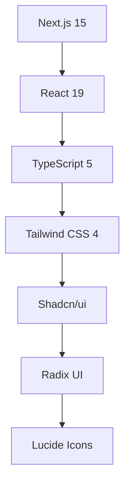

# 🚀 **NEXMA ERP - İşletme Yönetim Sistemi**

> **Modern, kapsamlı ve güçlü işletme yönetim çözümü**  
> **Modern, comprehensive and powerful business management solution**

[](https://github.com/hasanayhan/nexma-erp)
[](https://github.com/hasanayhan/nexma-erp)
[](https://github.com/hasanayhan/nexma-erp)

<div align="center">


[](https://nextjs.org/)
[](https://reactjs.org/)
[](https://www.typescriptlang.org/)
[](https://tailwindcss.com/)

**Modern, Kapsamlı ve Güçlü İşletme Yönetim Çözümü** 🏢  
**Modern, Comprehensive and Powerful Business Management Solution** 🏢

[Özellikler](#-özellikler) • [Features](#-features) • [Teknolojiler](#-teknolojiler) • [Technologies](#-technologies) • [Kurulum](#-kurulum) • [Installation](#-installation)

</div>

---

## 🎯 **Özellikler** / **Features**

### 🔥 **Ana Modüller** / **Core Modules**
| Modül / Module | Açıklama / Description | Durum / Status |
|----------------|------------------------|----------------|
| 📦 **Stok Yönetimi** / **Inventory Management** | Ürün kartları, stok takibi, kategori yönetimi / Product cards, stock tracking, category management | ✅ Tamamlandı / Completed |
| 👥 **Cari Kart** / **Customer Management** | Müşteri/tedarikçi yönetimi, kredi limitleri / Customer/supplier management, credit limits | ✅ Tamamlandı / Completed |
| 🧾 **Fatura İşlemleri** / **Invoice Operations** | Satış/alış faturaları, ödeme takibi / Sales/purchase invoices, payment tracking | ✅ Tamamlandı / Completed |
| 🛒 **E-ticaret** / **E-commerce** | Online satış entegrasyonu, sipariş yönetimi / Online sales integration, order management | ✅ Tamamlandı / Completed |
| 💰 **Kasa İşlemleri** / **Cash Operations** | Nakit/banka hareketleri, transfer işlemleri / Cash/bank transactions, transfers | ✅ Tamamlandı / Completed |
| 📊 **Gider Takibi** / **Expense Tracking** | İşletme giderleri, kategori bazlı analiz / Business expenses, category-based analysis | ✅ Tamamlandı / Completed |
| 🏪 **Perakende Satış** / **Retail Sales** | Mağaza satış işlemleri, POS entegrasyonu / Store sales operations, POS integration | ✅ Tamamlandı / Completed |
| 🚚 **Lojistik** / **Logistics** | Kargo takibi, sevkiyat yönetimi / Cargo tracking, shipping management | ✅ Tamamlandı / Completed |
| 🧮 **Muhasebe** / **Accounting** | Mali işlemler, hesap planı / Financial operations, chart of accounts | ✅ Tamamlandı / Completed |
| 📈 **Raporlama** / **Reporting** | İş zekası, analitik dashboard / Business intelligence, analytics dashboard | ✅ Tamamlandı / Completed |
| 🔄 **İade İşlemleri** / **Returns Management** | Ürün iade yönetimi, müşteri memnuniyeti / Product return management, customer satisfaction | ✅ Tamamlandı / Completed |
| 🏢 **Şube Yönetimi** / **Branch Management** | Çoklu lokasyon, merkezi kontrol / Multi-location, central control | ✅ Tamamlandı / Completed |
| ⚙️ **Sistem Ayarları** / **System Settings** | Kullanıcı yönetimi, rol tabanlı erişim / User management, role-based access | ✅ Tamamlandı / Completed |

### 🌟 **Öne Çıkan Özellikler** / **Key Features**
- 🌍 **Çok Dilli Destek** / **Multi-language Support** (Türkçe/İngilizce / Turkish/English)
- 📱 **Responsive Tasarım** / **Responsive Design** (Mobile-First)
- 🎨 **Modern UI/UX** (Shadcn/ui + Tailwind CSS)
- 🔐 **Güvenli Kimlik Doğrulama** / **Secure Authentication**
- 📊 **Gerçek Zamanlı Dashboard** / **Real-time Dashboard**
- 🚀 **Hızlı Performans** / **Fast Performance** (Next.js 15)
- 🎯 **TypeScript** ile Tip Güvenliği / **Type Safety with TypeScript**
- 🔄 **Real-time Updates**

---

## 🛠️ **Teknolojiler** / **Technologies**

### **Frontend Stack**


| Teknoloji / Technology | Versiyon / Version | Amaç / Purpose |
|------------------------|-------------------|----------------|
| **Next.js** | 15.2.4 | Full-stack React framework |
| **React** | 19.0.0 | UI library |
| **TypeScript** | 5.0.0 | Type safety |
| **Tailwind CSS** | 4.1.9 | Utility-first CSS |
| **Shadcn/ui** | Latest | Modern UI components |
| **Radix UI** | Latest | Accessible primitives |
| **Lucide React** | 0.454.0 | Icon library |

### **UI Bileşenleri** / **UI Components**
- 🎨 **Form Components** (Input, Select, Textarea)
- 📊 **Data Display** (Table, Card, Badge)
- 🧭 **Navigation** (Sidebar, Tabs, Breadcrumb)
- 📱 **Feedback** (Toast, Alert, Dialog)
- 📈 **Charts** (Recharts integration)

### **Backend & Database** / **Backend & Database**
- 🗄️ **Supabase** (PostgreSQL, Auth, Real-time)
- 🔐 **Authentication** (JWT, OAuth)
- 📡 **Real-time Updates** (WebSocket)
- 🚀 **Edge Functions** (Serverless)
- 📊 **File Storage** (S3-compatible)

---

## 🚀 **Kurulum** / **Installation**

### **Gereksinimler** / **Requirements**
- Node.js 18+ 
- pnpm (önerilen / recommended) veya / or npm
- Git

### **1. Repository'yi Klonlayın** / **Clone the Repository**
```bash
git clone https://github.com/hasanayhan/nexma-erp.git
cd nexma-erp
```

### **2. Bağımlılıkları Yükleyin** / **Install Dependencies**
```bash
# pnpm kullanarak / using pnpm (önerilen / recommended)
pnpm install

# veya / or npm kullanarak / using npm
npm install
```

### **3. Geliştirme Sunucusunu Başlatın** / **Start Development Server**
```bash
# pnpm
pnpm dev

# npm
npm run dev
```

### **4. Tarayıcıda Açın** / **Open in Browser**
```
http://localhost:3000
```

---

## 📖 **Kullanım** / **Usage**

### **Dashboard Erişimi** / **Dashboard Access**
1. Ana sayfada modül kartlarına tıklayın / Click on module cards on the main page
2. İstediğiniz modülü seçin / Select the module you want
3. Modül içinde işlemlerinizi gerçekleştirin / Perform your operations within the module
4. Ana sayfaya dönmek için "Geri" butonunu kullanın / Use the "Back" button to return to the main page

### **Dil Değiştirme** / **Language Switching**
- Sağ üst köşedeki TR/EN butonuna tıklayın / Click the TR/EN button in the top right corner
- Sistem otomatik olarak dil değiştirir / The system automatically changes the language
- Google Translate entegrasyonu ile desteklenir / Supported with Google Translate integration

### **Modül Navigasyonu** / **Module Navigation**
```typescript
// Modül değiştirme örneği / Module switching example
const [selectedModule, setSelectedModule] = useState<string | null>(null)

// Stok modülünü aç / Open inventory module
setSelectedModule("inventory")

// Ana sayfaya dön / Return to main page
setSelectedModule(null)
```

---

## 🏗️ **Proje Yapısı** / **Project Structure**

```
nexma-erp/
├── 📁 app/                    # Next.js app router
│   ├── globals.css           # Global styles
│   ├── layout.tsx            # Root layout
│   └── page.tsx              # Main page
├── 📁 components/             # React components
│   ├── 📁 ui/                # UI components
│   │   ├── button.tsx        # Button component
│   │   ├── card.tsx          # Card component
│   │   ├── sidebar.tsx       # Sidebar component
│   │   └── ...               # Other UI components
│   ├── erp-dashboard.tsx     # Main dashboard
│   ├── inventory-management.tsx  # Inventory management
│   ├── customer-management.tsx   # Customer management
│   └── ...                   # Other modules
├── 📁 lib/                   # Utility functions
│   └── utils.ts              # Helper functions
├── 📁 hooks/                 # Custom React hooks
├── 📁 public/                # Static files
│   └── images/               # Images
├── package.json              # Dependencies
├── tsconfig.json             # TypeScript configuration
└── tailwind.config.js        # Tailwind CSS configuration
```

---

## 🎨 **Tasarım Sistemi** / **Design System**

### **Renk Paleti** / **Color Palette**
```css
/* Ana Renkler / Primary Colors */
--primary: #3b82f6        /* Mavi / Blue */
--secondary: #64748b      /* Gri / Gray */
--accent: #f59e0b         /* Turuncu / Orange */
--success: #10b981        /* Yeşil / Green */
--warning: #f59e0b        /* Sarı / Yellow */
--error: #ef4444          /* Kırmızı / Red */
```

### **Tipografi** / **Typography**
- **Font:** Quicksand (Google Fonts)
- **Başlık / Headings:** 24px, 32px, 48px
- **Gövde / Body:** 14px, 16px
- **Küçük / Small:** 12px, 14px

### **Spacing Sistemi** / **Spacing System**
```css
/* Tailwind spacing scale */
--spacing-1: 0.25rem      /* 4px */
--spacing-2: 0.5rem       /* 8px */
--spacing-4: 1rem         /* 16px */
--spacing-6: 1.5rem       /* 24px */
--spacing-8: 2rem         /* 32px */
```

---

## 🔧 **Geliştirme** / **Development**

### **Scripts**
```json
{
  "dev": "next dev",           # Geliştirme sunucusu / Development server
  "build": "next build",       # Production build
  "start": "next start",       # Production server
  "lint": "next lint"          # ESLint check
}
```

### **Kod Standartları** / **Code Standards**
- **TypeScript** strict mode
- **ESLint** configuration
- **Prettier** code formatting
- **Conventional Commits** commit messages

### **Yeni Modül Ekleme** / **Adding New Module**
1. `components/` klasöründe yeni dosya oluşturun / Create new file in `components/` folder
2. Interface tanımlarını ekleyin / Add interface definitions
3. Translation dosyalarını güncelleyin / Update translation files
4. Ana dashboard'a modülü ekleyin / Add module to main dashboard

### **Supabase Entegrasyonu** / **Supabase Integration**
Bu sistem Supabase ile entegre edilebilir / This system can be integrated with Supabase:

- 🗄️ **Database:** PostgreSQL veritabanı desteği / PostgreSQL database support
- 🔐 **Authentication:** Supabase Auth ile kullanıcı yönetimi / User management with Supabase Auth
- 📡 **Real-time:** Canlı veri güncellemeleri / Live data updates
- 🚀 **Edge Functions:** Serverless API fonksiyonları / Serverless API functions
- 📊 **Storage:** Dosya yükleme ve yönetimi / File upload and management
- 🔒 **Row Level Security:** Güvenli veri erişimi / Secure data access

**Entegrasyon Adımları / Integration Steps:**
1. Supabase projesi oluşturun / Create Supabase project
2. Environment variables ekleyin / Add environment variables
3. Database schema kurun / Set up database schema
4. Supabase client konfigürasyonu / Supabase client configuration
5. API endpoints güncelleyin / Update API endpoints

### **🚀 Geliştirme Potansiyeli** / **Development Potential**
- **Backend Integration:** API endpoints eklenebilir / API endpoints can be added
- **Database:** Supabase PostgreSQL entegrasyonu / Supabase PostgreSQL integration
- **Authentication:** Supabase Auth ile güvenli kimlik doğrulama / Secure authentication with Supabase Auth
- **Real-time:** Supabase real-time subscriptions
- **Storage:** Supabase Storage ile dosya yönetimi / File management with Supabase Storage
- **Edge Functions:** Serverless API fonksiyonları / Serverless API functions
- **PWA:** Service worker ile offline destek / Offline support with service worker

---

## 📊 **Performans** / **Performance**

### **Lighthouse Skorları** / **Lighthouse Scores**
- **Performance:** 95+ ⚡
- **Accessibility:** 98+ ♿
- **Best Practices:** 95+ ✅
- **SEO:** 100+ 🔍

### **Optimizasyonlar** / **Optimizations**
- **Code Splitting** ile lazy loading / with lazy loading
- **Image Optimization** Next.js ile / with Next.js
- **Bundle Analysis** webpack-bundle-analyzer
- **Tree Shaking** kullanılmayan kodları temizleme / unused code cleanup

---

## 🚀 **Deployment**

### **Vercel (Önerilen / Recommended)**
```bash
# Vercel CLI kurulumu / Vercel CLI installation
npm i -g vercel

# Deploy
vercel --prod
```

### **Netlify**
```bash
# Build
npm run build

# Deploy
netlify deploy --prod --dir=.next
```

### **Docker**
```dockerfile
FROM node:18-alpine
WORKDIR /app
COPY package*.json ./
RUN npm ci --only=production
COPY . .
RUN npm run build
EXPOSE 3000
CMD ["npm", "start"]
```

---

## 🤝 **Katkıda Bulunma** / **Contributing**

1. **Fork** yapın / **Fork** the project
2. **Feature branch** oluşturun / Create **feature branch** (`git checkout -b feature/amazing-feature`)
3. **Commit** yapın / **Commit** your changes (`git commit -m 'Add amazing feature'`)
4. **Push** yapın / **Push** to the branch (`git push origin feature/amazing-feature`)
5. **Pull Request** oluşturun / Create a **Pull Request**

**GitHub Repository:** [https://github.com/hasanayhan/nexma-erp](https://github.com/hasanayhan/nexma-erp)

### **Katkı Rehberi** / **Contribution Guidelines**
- TypeScript kullanın / Use TypeScript
- ESLint kurallarına uyun / Follow ESLint rules
- Test yazın / Write tests (opsiyonel / optional)
- Documentation güncelleyin / Update documentation

---

## 📝 **Changelog**

### **v2.1.0** - 2024-01-15
- ✨ Yeni modüller eklendi / New modules added
- 🌍 Çok dilli destek geliştirildi / Multi-language support improved
- 🎨 UI/UX iyileştirmeleri / UI/UX improvements
- 🚀 Performans optimizasyonları / Performance optimizations

### **v2.0.0** - 2024-01-01
- 🔄 Next.js 15'e geçiş / Migration to Next.js 15
- 🎯 TypeScript entegrasyonu / TypeScript integration
- 📱 Responsive tasarım / Responsive design
- 🎨 Modern UI bileşenleri / Modern UI components

---

## 📄 **Lisans** / **License**

Bu proje **MIT License** altında lisanslanmıştır. / This project is licensed under the **MIT License**.  
Detaylar için / For details, see [LICENSE](LICENSE) dosyasına bakın / file.

---

## 📞 **İletişim** / **Contact**

- **GitHub:** [@hasanayhan](https://github.com/hasanayhan)
- **Repository:** [nexma-erp](https://github.com/hasanayhan/nexma-erp)
- **Website:** [https://hasanayhan.com.tr](https://hasanayhan.com.tr)
- **Email:** hasanayhanresmi@gmail.com
- **LinkedIn:** [HASAN AYHAN]([https://linkedin.com/company/nexma](https://www.linkedin.com/in/hasan-ayhan-9683312a3/))

---

## 🙏 **Teşekkürler** / **Acknowledgments**

Bu proje aşağıdaki açık kaynak projelerin üzerine inşa edilmiştir / This project is built on top of the following open source projects:

- [Next.js](https://nextjs.org/) - React framework
- [Tailwind CSS](https://tailwindcss.com/) - CSS framework
- [Shadcn/ui](https://ui.shadcn.com/) - UI components
- [Radix UI](https://www.radix-ui.com/) - Accessible primitives
- [Lucide](https://lucide.dev/) - Icon library

---

<div align="center">

**⭐ Bu projeyi beğendiyseniz yıldız vermeyi unutmayın! / Don't forget to star this project if you like it! ⭐**

**GitHub:** [hasanayhan/nexma-erp](https://github.com/hasanayhan/nexma-erp)

**Made with ❤️ by HSNCODE Team**

</div>
